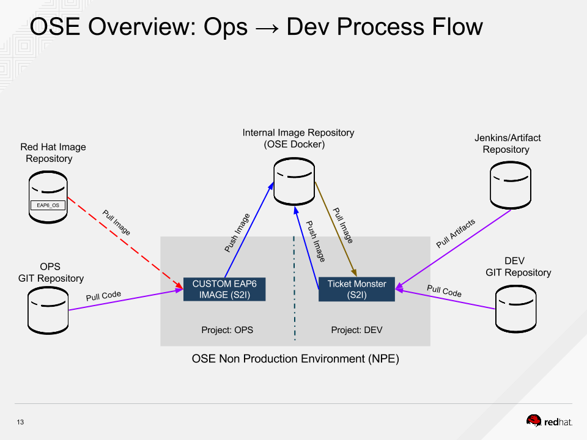
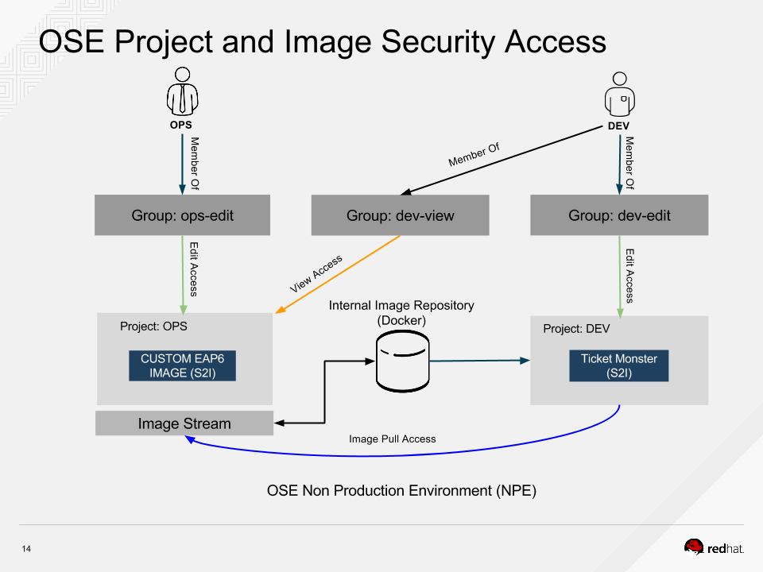

# Operations Workflow for Customizing Builder Images #


This demonstration describes how Dev code and Ops code are merged in the build pipeline on OpenShfit V3.


## Table of Contents

* [Overview](#overview)
* [Bill of Materials](#bill-of-materials)
	* [Environment Specifications](#environment-specifications)
	* [Template Files](#template-files)
	* [Config Files](#config-files)
	* [External Source Code Repositories](#external-source-code-repositories)
* [Setup Instructions](#setup-instructions)
* [Presenter Notes](#presenter-notes)
	* [Main Demo Steps](#main-demo-steps)
* [Resources](#resources)


## Overview

The demo aims to show how the Ops group can customize an external image (Red Hat JBoss Enterprise Application Platform (EAP) 6) and then have that image used by development.  The following diagram shows that process at a high level.  The demo


The demo also includes a basic security outline on groups can control access to both the Ops and Development projects.  The following diagram show the security model that's utilized in the demo.  


*The full presentation deck is included in the Git repo.*


## Bill of Materials

### Environment Specifications

This demo should be run on an installation of OpenShift Enterprise V3

### Template Files

None

### Config Files

None

### External Source Code Repositories

* [Ticket Monster](https://github.com/jboss-developer/ticket-monster) -  Public repository for the Ticket Monster application, used to generate war artifact.  
* [Ops Repo - EAP6 Customization](https://github.com/rhtconsulting/ops-custom-eap6) -  Public repository that holds configuration information (Infrastructure as Code) used to generate (in our case) a custom EAP6 image.
* [Ticket Monster s2i Image Build](https://github.com/rhtconsulting/ticket-monster-ose-s2i-build) - Public repository that holds the scripts (s2i) used to consume development artifacts (war) and create a docker image.


## Setup Instructions

There are two general requirement for this demo.
1. The presenter should have an OpenShift Enterprise 3 environment available and the OpenShift Command Line Tools installed on their machine
2. A Jenkins server (or other artifact repository) is required to host the development artifact (war)

## Presenter Notes

The following steps are to be used to demonstrate how Dev code and Ops code are merged in the build pipeline on OpenShfit V3.


### Main Demo Steps

In the demo 3 separate users will be need.  

Create `tsar`, who will be the cluster admin.  *This action must be performed on all masters in the cluster.*
```bash
htpasswd /etc/origin/htpasswd tsar
```

Create a `dev` user.  *This action must be performed on all masters in the cluster.*
```bash
htpasswd /etc/origin/htpasswd dev
```

Create the `ops` user. *This action must be performed on all masters in the cluster.*
```bash
htpasswd /etc/origin/htpasswd ops
```

**All the commands below need to be run on any master in the cluster.**

Login as the `system:admin` user
```bash
oc login -u system:admin
```

Promote `tsar` to a cluster administrator
```bash
oadm policy add-cluster-role-to-user cluster-admin tsar
```

Create the two projects (Ops and Dev) that will be used in the demo
```bash
oc new-project ops-custom-eap6-proj && oc new-project ticket-monster-proj
```

Create the three groups necessary for security
`ops-edit`, a member of this group will have full access to the Ops project.
`dev-view`, a member of this group will have view access to the Ops project.
`dev-edit`, a member of this group will have full access to the Dev project.
```bash
oadm groups new ops-edit && oadm groups new dev-view && oadm groups new dev-edit
```

Add the `ops` user to the `ops-edit` group, add the `dev` user to both the `dev-view` and `dev-edit` groups
```bash
oadm groups add-users ops-edit ops && oadm groups add-users dev-view dev && oadm groups add-users dev-edit dev
```

Grants group access level to specific projects
Gives the `ops-edit` group edit access to the eap project
Gives the `dev-view` group edit access to the eap project
Gives the `dev-edit` group edit access to the ticket monster image build project
Gives the ticket-monster-proj access to pull the custom image from the eap project
```bash
oadm policy add-role-to-group edit ops-edit -n ops-custom-eap6-proj && \
oadm policy add-role-to-group view dev-view -n ops-custom-eap6-proj && \
oadm policy add-role-to-group edit dev-edit -n ticket-monster-proj && \
oadm policy add-role-to-group system:image-puller system:serviceaccounts:ticket-monster-proj -n ops-custom-eap6-proj
```

Use the following command to verify that group and access were created correctly
```bash
oc describe policyBindings :default -n ops-custom-eap6-proj && \
oc describe policyBindings :default -n ticket-monster-proj
```

Log in as the `ops` user
```bash
oc login -u ops
```

Create the Ops application
```bash
oc new-app registry.access.redhat.com/jboss-eap-6/eap-openshift~http://github.com/rhtconsulting/ops-custom-eap6.git --name=ops-custom-eap6 --namespace=ops-custom-eap6-proj
```

Launch a web browser and navigate to the OSE login page.  Login as `ops` and monitor the image build and deploy.  


Login as the `dev` user
```bash
oc login -u dev
```

Create the app, using the image created by the `ops-custom-eap6` project
```bash
oc project ticket-monster-proj && \
oc new-app ops-custom-eap6-proj/ops-custom-eap6:latest~http://github.com/rhtconsulting/ticket-monster-build.git --name=ticket-monster && \
oc expose service ticket-monster --name=ticket-monster-route --hostname=ticket-monster.[Enter Hostname]
```


Launch a web browser and navigate to the OSE login page.  Login as `dev` and monitor the image build and deploy.  Finally show how the application is using the `ops-custom-eap6` image.
As the `dev` user open the `ops-custom-eap6-proj` and demonstrate how the `dev` user cannot scale the application (security).

Launch a web browser and navigate to the OSE login page.  Login as `tsar` and show how this user has full access to both projects.


### Points of emphasis

* Make sure to login as each of the three users to demonstrate that security if fully functional.
* When discussing security make sure to acknowledge that security is implemented using htpass.  However, since groups are used a transition to LDAP is possible by using groups that already exist in the LDAP environment.  


## Resources
See presentation deck that's included as part of the Git repo.
