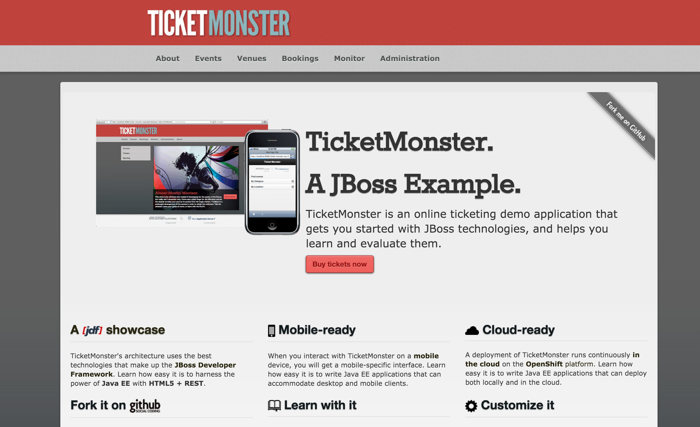

# Ticket-Monster OpenShift V3 Demo

This demonstration describes the process for building and deploying Ticket-Monster  application on OpenShfit V3



## Table of Contents

* [Overview](#overview)
* [Bill of Material](#bill-of-materials)
	* [Environment Specifications](#environment-specifications)
	* [Template Files](#template-files)
	* [Config Files](#config-files)
	* [External Source Code Repositories](#external-source-code-repositories)
* [Setup Instructions](#setup-instructions)
* [Presenter Notes](#presenter-notes)
	* [Deploy via Docker Image](#deploy-via-docker-image)
	* [Deploy via Template](#deploy-via-template)
* [Resources](#resources)

## Overview

The Ticket-Monster is a moderately complex application that demonstrates how to build modern applications using JBoss web technologies.  A full overview of the project can be found on the [Ticket Monster jboss.org site](http://www.jboss.org/ticket-monster/).

OpenShift supports several methods for deploying JBoss Applications within the OpenShift V3 environment will be demonstrated. This demonstration will describe the process for creating a new application by specifying a docker image or a template.  

## Bill of Materials

### Environment Specifications

This demo should be run on an installation of OpenShift Enterprise V3

### Template Files

* eap64-basic-s2i - JBoss EAP 6.4 basic template from the `openshift` namespace

### Config Files

None

### External Source Code Repositories

* [Ticket Monster](https://github.com/jboss-developer/ticket-monster) -  Public repository for the Ticket Monster application

## Setup Instructions

There is no specific requirements necessary for this demonstration. The presenter should have an OpenShift Enterprise 3 environment available and the OpenShift Command Line Tools installed on their machine.

## Presenter Notes

The following steps are to be used to demonstrate two methods for deploying the Ticket Monster application in OpenShift V3

### Deploy via Docker Image

A Docker image containing the JBoss Enterprise Platform and that is compatible with the Source to Image process can be used to build and deploy application source code.

Create a new project called `ticket-monster-image` to contain the resources. Using the terminal, execute the following to create the new project:

    oc new-project ticket-monster-image
    
Create a new application by passing in the docker image name, source code repository, branch and the context directory within the repository containing the source code

    oc new-app jboss-eap64-openshift~https://github.com/jboss-developer/ticket-monster#2.7.0.Final --context-dir=demo --name=ticketmonster

Let's break down the command in further detail

* `oc new-app` - OpenShift command to create a new application
* `jboss-eap64-openshift` - Name of the Docker Image (S2I compatible)
* `~` - Specifying that source code will be provided
* `https://github.com/jboss-developer/ticket-monster` - URL of the Git repository
* `#2.7.0.Final` - Branch name
* `--context-dir` - Location within the repository containing source code
* `--name=ticketmonster` - Name for all of the created resources


After executing the command, the following is shown displaying the objects that were created

```
--> Found image 7c80ddb (2 weeks old) in image stream "jboss-eap64-openshift in project openshift" under tag :latest for "jboss-eap64-openshift"
    * A source build using source code from https://github.com/jboss-developer/ticket-monster#2.7.0.Final will be created
      * The resulting image will be pushed to image stream "ticketmonster:latest"
    * This image will be deployed in deployment config "ticketmonster"
    * Ports 8080/tcp, 8443/tcp, 8778/tcp will be load balanced by service "ticketmonster"
--> Creating resources with label app=ticketmonster ...
    ImageStream "ticketmonster" created
    BuildConfig "ticketmonster" created
    DeploymentConfig "ticketmonster" created
    Service "ticketmonster" created
--> Success
    Build scheduled for "ticketmonster" - use the logs command to track its progress.
    Run 'oc status' to view your app.
```

A new image will be built combining the source code from the Git repository and the base JBoss image.

Create a route to the application so that can be access from outside the OpenShift cluster by exposing the `ticketmonster` service

    oc expose service ticketmonster

This will make the application available at `http://ticketmonster-ticket-monster-image.<app_subdomain>`

You can verify the hostname by running `oc get route ticketmonster`
 
Launch a web browser and navigate to the hostname found above to view the application


### Deploy via Template 

Ticket Monster can also be deployed using a template. A template provides the definition for the OpenShift objects that should be created to build, deploy and access an application. OpenShift contains a set of built in templates to allow developers to quickly become productive with the platform which are located in the *openshift* project. 

The `eap64-basic-s2i` template from the *openshift* namespace provides a simple method for building and deploying JBoss Applications and can be used to deploy the Ticket Monster application. 

A template also allows parameters to be passed during processing to dynamically configure OpenShift objects. When using the `oc new-app` command, parameters can be added by using `-p=key1=value1,key2=value2` 

Create a new project called `ticket-monster-template`. 

    oc new-project ticket-monster-template

Now, instantiate the `eap64-basic-s2i` template based on the configuration for the Ticket Monster application

    oc new-app --template=eap64-basic-s2i -p=APPLICATION_NAME=ticketmonster,SOURCE_REPOSITORY_URL=https://github.com/jboss-developer/ticket-monster,SOURCE_REPOSITORY_REF=2.7.0.Final,CONTEXT_DIR=demo

After executing the command, the following is shown displaying the objects that were created:

```
--> Deploying template eap64-basic-s2i in project openshift for "eap64-basic-s2i"
     With parameters:
      APPLICATION_NAME=ticketmonster
      APPLICATION_DOMAIN=
      SOURCE_REPOSITORY_URL=https://github.com/jboss-developer/ticket-monster
      SOURCE_REPOSITORY_REF=2.7.0.Final
      CONTEXT_DIR=demo
      HORNETQ_QUEUES=
      HORNETQ_TOPICS=
      HORNETQ_CLUSTER_PASSWORD=A5p5umq8 # generated
      GITHUB_WEBHOOK_SECRET=acttDLBN # generated
      GENERIC_WEBHOOK_SECRET=rw4U3ndX # generated
      IMAGE_STREAM_NAMESPACE=openshift
--> Creating resources with label app=ticketmonster ...
    Service "ticketmonster" created
    Route "ticketmonster" created
    ImageStream "ticketmonster" created
    BuildConfig "ticketmonster" created
    DeploymentConfig "ticketmonster" created
--> Success
    Build scheduled for "ticketmonster" - use the logs command to track its progress.
    Run 'oc status' to view your app.
```

A new build using the Source to Image will be started to produce a new docker image

Unlike the previous example, the template defines a route be created, so there is no need to expose a service. This can be verified by running the `oc get route ticketmonster`

Launch a web browser and navigate to the hostname found above


## Resources

* [Creating New Applications](https://docs.openshift.com/enterprise/latest/dev_guide/new_app.html)
* [Templates](https://docs.openshift.com/enterprise/latest/architecture/core_concepts/templates.html)